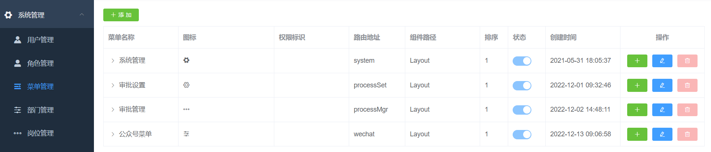
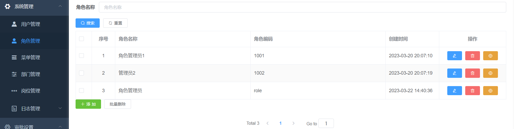
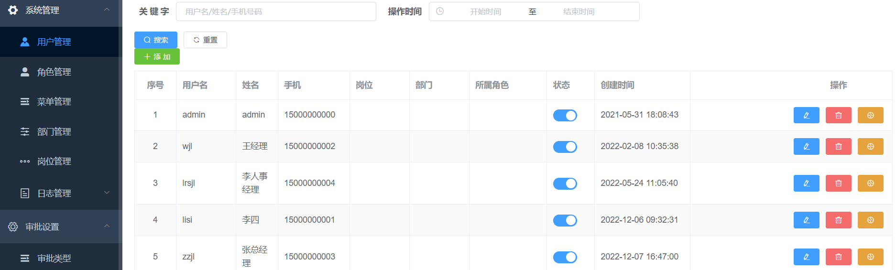
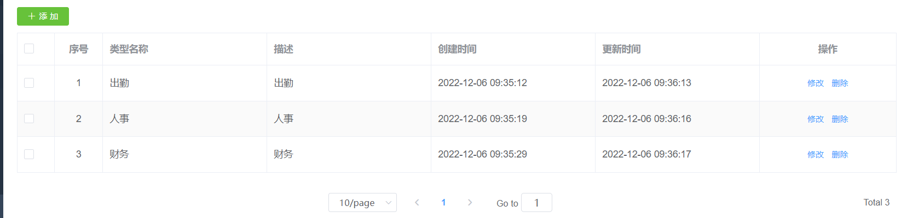
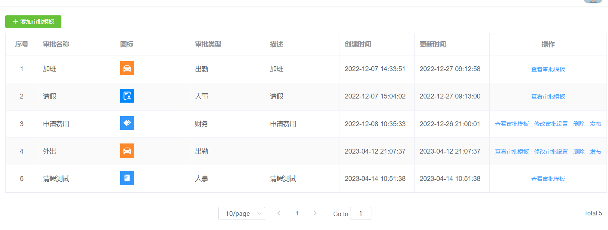
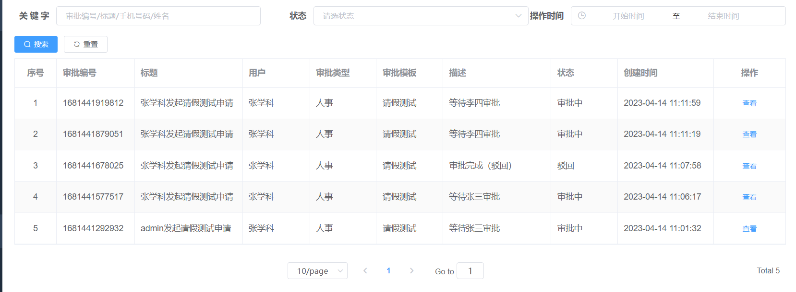
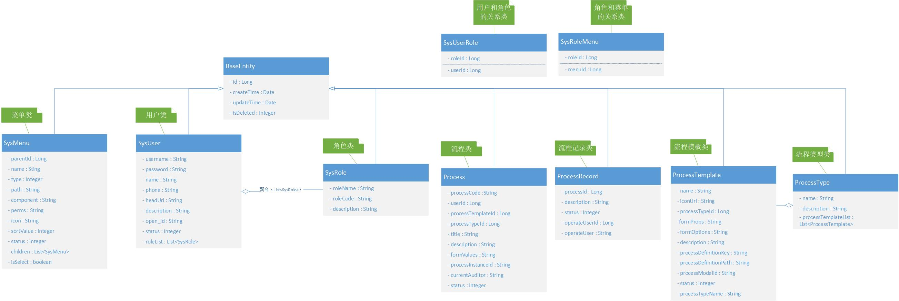
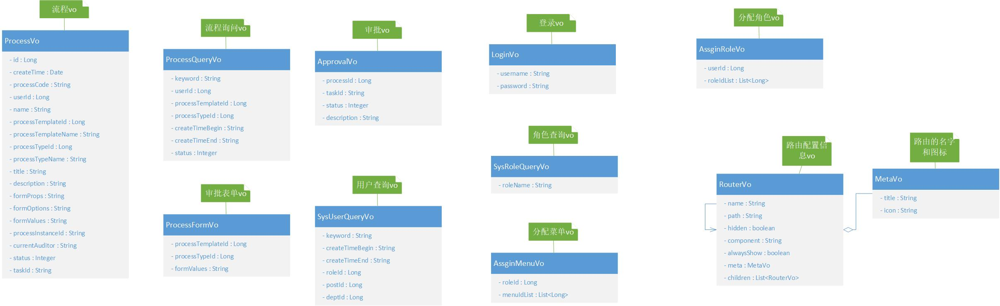

# OA
一个有权限管理的办公系统，可以流程部署，用户页面可以使用微信公众号

## 核心技术

| **基础框架：SpringBoot**                                     |
| ------------------------------------------------------------ |
| 数据缓存：Redis                                              |
| 数据库：MySQL                                                |
| 权限控制：SpringSecurity                                     |
| 工作流引擎：Activiti                                         |
| 前端技术：vue-admin-template + Node.js + Npm + Vue + ElementUI + Axios |
| 微信公众号：公众号菜单 + 微信授权登录 + 消息推送             |

## 后端系统管理页面：

## 审批管理页面：

# 类图

## oa_process表 

该表存储了审批流程的信息，包括审批人、审批状态等。 

| **列名**            | **数据类型** | **允许为空** | **默认值**        | **注释**                                       |
| ------------------- | ------------ | ------------ | ----------------- | ---------------------------------------------- |
| id                  | bigint(20)   | 否           | 自增              | id                                             |
| process_code        | varchar(50)  | 否           | ''                | 审批code                                       |
| user_id             | bigint(1)    | 否           | 0                 | 用户id                                         |
| process_template_id | bigint(20)   | 是           | NULL              | 审批模板id                                     |
| process_type_id     | bigint(20)   | 是           | NULL              | 审批类型id                                     |
| title               | varchar(255) | 是           | NULL              | 标题                                           |
| description         | varchar(255) | 是           | NULL              | 描述                                           |
| form_values         | text         | 是           | NULL              | 表单值                                         |
| process_instance_id | varchar(255) | 是           | NULL              | 流程实例id                                     |
| current_auditor     | varchar(255) | 是           | NULL              | 当前审批人                                     |
| status              | tinyint(3)   | 是           | NULL              | 状态（0：默认 1：审批中 2：审批通过 -1：驳回） |
| create_time         | timestamp    | 否           | CURRENT_TIMESTAMP | 创建时间                                       |
| update_time         | timestamp    | 否           | CURRENT_TIMESTAMP | 更新时间                                       |
| is_deleted          | tinyint(3)   | 否           | 0                 | 删除标记（0:不可用 1:可用）                    |

## oa_process_record表  

该表存储审批记录。

| **列名**        | **数据类型** | **可否为空** | **默认值**                                    | **注释**                    |
| --------------- | ------------ | ------------ | --------------------------------------------- | --------------------------- |
| id              | bigint(20)   | 否           | AUTO_INCREMENT                                | id                          |
| process_id      | bigint(20)   | 否           | 0                                             | 审批流程id                  |
| description     | varchar(255) | 是           | NULL                                          | 审批描述                    |
| status          | tinyint(3)   | 是           | 0                                             | 状态                        |
| operate_user_id | bigint(20)   | 否           | 0                                             | 操作用户id                  |
| operate_user    | varchar(20)  | 是           | NULL                                          | 操作用户                    |
| create_time     | timestamp    | 否           | CURRENT_TIMESTAMP                             | 创建时间                    |
| update_time     | timestamp    | 否           | CURRENT_TIMESTAMP ON UPDATE CURRENT_TIMESTAMP | 更新时间                    |
| is_deleted      | tinyint(3)   | 否           | 0                                             | 删除标记（0:不可用 1:可用） |

## oa_process_template表

该表存储审批模板。

| 列名                    | 数据类型     | 可否为空 | 默认值                                        | 注释                        |
| ----------------------- | ------------ | -------- | --------------------------------------------- | --------------------------- |
| id                      | bigint(20)   | 否       | AUTO_INCREMENT                                | 角色id                      |
| name                    | varchar(20)  | 否       | ''                                            | 模板名称                    |
| icon_url                | varchar(100) | 是       | NULL                                          | 图标路径                    |
| process_type_id         | varchar(255) | 是       | NULL                                          | 审批类型id                  |
| form_props              | text         | 是       | NULL                                          | 表单属性                    |
| form_options            | text         | 是       | NULL                                          | 表单选项                    |
| process_definition_key  | varchar(20)  | 是       | NULL                                          | 流程定义key                 |
| process_definition_path | varchar(255) | 是       | NULL                                          | 流程定义上传路径            |
| process_model_id        | varchar(255) | 是       | NULL                                          | 流程定义模型id              |
| description             | varchar(255) | 是       | NULL                                          | 描述                        |
| status                  | tinyint(3)   | 否       | 0                                             | 状态                        |
| create_time             | timestamp    | 否       | CURRENT_TIMESTAMP                             | 创建时间                    |
| update_time             | timestamp    | 否       | CURRENT_TIMESTAMP ON UPDATE CURRENT_TIMESTAMP | 更新时间                    |
| is_deleted              | tinyint(3)   | 否       | 0                                             | 删除标记（0:不可用 1:可用） |

## oa_process_type表

该表存储审批类型。

| **列名**    | **数据类型** | **可否为空** | **默认值**                                    | **注释**                    |
| ----------- | ------------ | ------------ | --------------------------------------------- | --------------------------- |
| id          | bigint(20)   | 否           | AUTO_INCREMENT                                | id                          |
| name        | varchar(20)  | 否           | ''                                            | 类型名称                    |
| description | varchar(255) | 是           | NULL                                          | 描述                        |
| create_time | timestamp    | 否           | CURRENT_TIMESTAMP                             | 创建时间                    |
| update_time | timestamp    | 否           | CURRENT_TIMESTAMP ON UPDATE CURRENT_TIMESTAMP | 更新时间                    |
| is_deleted  | tinyint(3)   | 否           | 0                                             | 删除标记（0:不可用 1:可用） |

## sys_dept表

该表存储组织机构信息。

| **列名**    | **数据类型** | **可否为空** | **默认值**        | **注释**                    |
| ----------- | ------------ | ------------ | ----------------- | --------------------------- |
| id          | bigint(20)   | 否           | AUTO_INCREMENT    | id                          |
| name        | varchar(50)  | 否           | ''                | 部门名称                    |
| parent_id   | bigint(20)   | 否           | 0                 | 上级部门id                  |
| tree_path   | varchar(255) | 否           | ','               | 树结构                      |
| sort_value  | int(11)      | 否           | 1                 | 排序                        |
| leader      | varchar(20)  | 是           | NULL              | 负责人                      |
| phone       | varchar(11)  | 是           | NULL              | 电话                        |
| status      | tinyint(1)   | 否           | 1                 | 状态（1正常 0停用）         |
| create_time | timestamp    | 否           | CURRENT_TIMESTAMP | 创建时间                    |
| update_time | timestamp    | 是           | NULL              | 更新时间                    |
| is_deleted  | tinyint(3)   | 否           | 0                 | 删除标记（0:不可用 1:可用） |

## sys_login_log 表

该表用于记录系统访问记录

| **字段名**  | **数据类型** | **可否为空** | **默认值**        | **描述**                    |
| ----------- | ------------ | ------------ | ----------------- | --------------------------- |
| id          | bigint(20)   | 否           | AUTO_INCREMENT    | 访问ID                      |
| username    | varchar(50)  | 是           | ''                | 用户账号                    |
| ipaddr      | varchar(128) | 是           | ''                | 登录IP地址                  |
| status      | tinyint(1)   | 是           | 0                 | 登录状态（0成功 1失败）     |
| msg         | varchar(255) | 是           | ''                | 提示信息                    |
| access_time | datetime     | 是           | NULL              | 访问时间                    |
| create_time | timestamp    | 否           | CURRENT_TIMESTAMP | 创建时间                    |
| update_time | timestamp    | 是           | NULL              | 更新时间                    |
| is_deleted  | tinyint(3)   | 否           | 0                 | 删除标记（0:不可用 1:可用） |

## sys_menu 表

该表用于记录系统菜单信息

| **字段名**  | **数据类型** | **可否为空** | **默认值**                                    | **描述**                    |
| ----------- | ------------ | ------------ | --------------------------------------------- | --------------------------- |
| id          | bigint(20)   | 否           | AUTO_INCREMENT                                | 编号                        |
| parent_id   | bigint(20)   | 否           | 0                                             | 所属上级                    |
| name        | varchar(20)  | 否           | ''                                            | 名称                        |
| type        | tinyint(3)   | 否           | 0                                             | 类型(0:目录,1:菜单,2:按钮)  |
| path        | varchar(100) | 是           | NULL                                          | 路由地址                    |
| component   | varchar(100) | 是           | NULL                                          | 组件路径                    |
| perms       | varchar(100) | 是           | NULL                                          | 权限标识                    |
| icon        | varchar(100) | 是           | NULL                                          | 图标                        |
| sort_value  | int(11)      | 是           | NULL                                          | 排序                        |
| status      | tinyint(4)   | 是           | NULL                                          | 状态(0:禁止,1:正常)         |
| create_time | timestamp    | 否           | CURRENT_TIMESTAMP                             | 创建时间                    |
| update_time | timestamp    | 否           | CURRENT_TIMESTAMP ON UPDATE CURRENT_TIMESTAMP | 更新时间                    |
| is_deleted  | tinyint(3)   | 否           | 0                                             | 删除标记（0:不可用 1:可用） |

## sys_oper_log 表

该表用于记录系统操作日志

| **字段名**     | **数据类型**  | **可否为空** | **默认值**                                    | **描述**                                |
| -------------- | ------------- | ------------ | --------------------------------------------- | --------------------------------------- |
| id             | bigint(20)    | 否           | AUTO_INCREMENT                                | 日志主键                                |
| title          | varchar(50)   | 是           | ''                                            | 模块标题                                |
| business_type  | varchar(20)   | 是           | '0'                                           | 业务类型（0其它 1新增 2修改 3删除）     |
| method         | varchar(100)  | 是           | ''                                            | 方法名称                                |
| request_method | varchar(10)   | 是           | ''                                            | 请求方式                                |
| operator_type  | varchar(20)   | 是           | '0'                                           | 操作类别（0其它 1后台用户 2手机端用户） |
| oper_name      | varchar(50)   | 是           | ''                                            | 操作人员                                |
| dept_name      | varchar(50)   | 是           | ''                                            | 部门名称                                |
| oper_url       | varchar(255)  | 是           | ''                                            | 请求URL                                 |
| oper_ip        | varchar(128)  | 是           | ''                                            | 主机地址                                |
| oper_param     | varchar(2000) | 是           | ''                                            | 请求参数                                |
| json_result    | varchar(2000) | 是           | ''                                            | 返回参数                                |
| status         | int(1)        | 是           | 0                                             | 操作状态（0正常 1异常）                 |
| error_msg      | varchar(2000) | 是           | ''                                            | 错误消息                                |
| oper_time      | datetime      | 是           | NULL                                          | 操作时间                                |
| create_time    | timestamp     | 否           | CURRENT_TIMESTAMP ON UPDATE CURRENT_TIMESTAMP | 创建时间                                |
| update_time    | timestamp     | 是           | NULL                                          | 更新时间                                |
| is_deleted     | tinyint(3)    | 否           | 0                                             | 删除标记（0:不可用 1:可用）             |

## sys_post 表

该表用于记录岗位信息

| 字段名      | 数据类型     | 可否为空 | 默认值                                        | 描述                        |
| ----------- | ------------ | -------- | --------------------------------------------- | --------------------------- |
| id          | bigint(20)   | 否       | AUTO_INCREMENT                                | 岗位ID                      |
| post_code   | varchar(64)  | 否       |                                               | 岗位编码                    |
| name        | varchar(50)  | 否       | ''                                            | 岗位名称                    |
| description | varchar(255) | 否       | ''                                            | 描述                        |
| status      | tinyint(1)   | 否       | 1                                             | 状态（1正常 0停用）         |
| create_time | timestamp    | 否       | CURRENT_TIMESTAMP ON UPDATE CURRENT_TIMESTAMP | 创建时间                    |
| update_time | timestamp    | 是       | NULL                                          | 更新时间                    |
| is_deleted  | tinyint(3)   | 否       | 0                                             | 删除标记（0:不可用 1:可用） |

##  sys_role 表

该表用于记录角色信息

| **字段名**  | **数据类型** | **可否为空** | **默认值**                                    | **描述**                    |
| ----------- | ------------ | ------------ | --------------------------------------------- | --------------------------- |
| id          | bigint(20)   | 否           | AUTO_INCREMENT                                | 角色id                      |
| role_name   | varchar(20)  | 否           | ''                                            | 角色名称                    |
| role_code   | varchar(20)  | 是           | NULL                                          | 角色编码                    |
| description | varchar(255) | 是           | NULL                                          | 描述                        |
| create_time | timestamp    | 否           | CURRENT_TIMESTAMP                             | 创建时间                    |
| update_time | timestamp    | 否           | CURRENT_TIMESTAMP ON UPDATE CURRENT_TIMESTAMP | 更新时间                    |
| is_deleted  | tinyint(3)   | 否           | 0                                             | 删除标记（0:不可用 1:可用） |

## sys_role_menu 表

该表用于记录角色和菜单的关系

| **字段名**  | **数据类型** | **可否为空** | **默认值**                                    | **描述**                    |
| ----------- | ------------ | ------------ | --------------------------------------------- | --------------------------- |
| id          | bigint(20)   | 否           | AUTO_INCREMENT                                | 主键                        |
| role_id     | bigint(20)   | 否           | 0                                             | 角色ID                      |
| menu_id     | bigint(11)   | 否           | 0                                             | 菜单ID                      |
| create_time | timestamp    | 否           | CURRENT_TIMESTAMP                             | 创建时间                    |
| update_time | timestamp    | 否           | CURRENT_TIMESTAMP ON UPDATE CURRENT_TIMESTAMP | 更新时间                    |
| is_deleted  | tinyint(3)   | 否           | 0                                             | 删除标记（0:不可用 1:可用） |

## sys_user 表

该表用于记录会员信息

| **字段名**  | **数据类型** | **可否为空** | **默认值**                                    | **描述**                    |
| ----------- | ------------ | ------------ | --------------------------------------------- | --------------------------- |
| id          | bigint(20)   | 否           | AUTO_INCREMENT                                | 会员id                      |
| username    | varchar(20)  | 否           | ''                                            | 用户名                      |
| password    | varchar(32)  | 否           | ''                                            | 密码                        |
| name        | varchar(50)  | 是           | NULL                                          | 姓名                        |
| phone       | varchar(11)  | 是           | NULL                                          | 手机                        |
| head_url    | varchar(200) | 是           | NULL                                          | 头像地址                    |
| dept_id     | bigint(20)   | 是           | NULL                                          | 部门id                      |
| post_id     | bigint(20)   | 是           | NULL                                          | 岗位id                      |
| open_id     | varchar(255) | 是           | NULL                                          | 微信openId                  |
| description | varchar(255) | 是           | NULL                                          | 描述                        |
| status      | tinyint(3)   | 是           | NULL                                          | 状态（1：正常 0：停用）     |
| create_time | timestamp    | 否           | CURRENT_TIMESTAMP                             | 创建时间                    |
| update_time | timestamp    | 否           | CURRENT_TIMESTAMP ON UPDATE CURRENT_TIMESTAMP | 更新时间                    |
| is_deleted  | tinyint(3)   | 否           | 0                                             | 删除标记（0:不可用 1:可用） |

## sys_user_role 表

该表用于记录用户和角色的关系

| **字段名**  | **数据类型** | **可否为空** | **默认值**                                    | **描述**                    |
| ----------- | ------------ | ------------ | --------------------------------------------- | --------------------------- |
| id          | bigint(20)   | 否           | AUTO_INCREMENT                                | 主键id                      |
| role_id     | bigint(20)   | 否           | 0                                             | 角色id                      |
| user_id     | bigint(20)   | 否           | 0                                             | 用户id                      |
| create_time | timestamp    | 否           | CURRENT_TIMESTAMP                             | 创建时间                    |
| update_time | timestamp    | 否           | CURRENT_TIMESTAMP ON UPDATE CURRENT_TIMESTAMP | 更新时间                    |
| is_deleted  | tinyint(3)   | 否           | 0                                             | 删除标记（0:不可用 1:可用） |

## wechat_menu 表

该表用于记录微信菜单信息

| **字段名**  | **数据类型** | **可否为空** | **默认值**                                    | **描述**                         |
| ----------- | ------------ | ------------ | --------------------------------------------- | -------------------------------- |
| id          | bigint(20)   | 否           | AUTO_INCREMENT                                | 编号                             |
| parent_id   | bigint(20)   | 是           | NULL                                          | 上级id                           |
| name        | varchar(50)  | 是           | NULL                                          | 菜单名称                         |
| type        | varchar(10)  | 是           | NULL                                          | 类型                             |
| url         | varchar(100) | 是           | NULL                                          | 网页链接，用户点击菜单可打开链接 |
| meun_key    | varchar(20)  | 是           | NULL                                          | 菜单KEY值，用于消息接口推送      |
| sort        | tinyint(3)   | 是           | NULL                                          | 排序                             |
| create_time | timestamp    | 否           | CURRENT_TIMESTAMP                             | 创建时间                         |
| update_time | timestamp    | 否           | CURRENT_TIMESTAMP ON UPDATE CURRENT_TIMESTAMP | 更新时间                         |
| is_deleted  | tinyint(3)   | 否           | 0                                             | 删除标记（0:不可用 1:可用）      |

